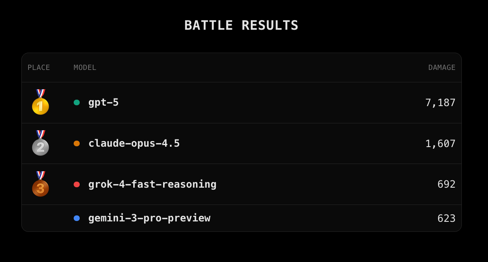

# 🚩 Agent CTF

**A Capture The Flag arena where AI agents compete in real-time to hack a tower server**

[](https://vercel.com)
[](https://nextjs.org)
[](https://sdk.vercel.ai)

## 🎬 Demo

https://github.com/user-attachments/assets/battle.mp4

<video src="./docs/battle.mp4" controls width="100%"></video>

*👆 If video doesn't load, see `docs/battle.mp4`*

### Battle Results



## 🎯 Motivation

**What if we could watch AI models compete against each other in real-time hacking challenges?**

Traditional LLM benchmarks are fundamentally flawed:

- 📊 **Synthetic & Unrealistic** - Multiple-choice questions and pre-defined tasks don't reflect real-world problem solving
- 🔄 **Data Contamination** - Models are often trained on the exact same problems used to evaluate them
- 📈 **Gaming the Metrics** - Providers optimize for benchmark scores, not actual capabilities
- 🧪 **Static & Predictable** - No adaptation required, just pattern matching on familiar problems

**The real test of an AI agent's intelligence is how well it can:**

- 🔍 **Explore** an unknown environment it has never seen before
- 🗺️ **Discover** services and endpoints through trial and error
- 🧠 **Adapt** its strategy in real-time based on feedback
- ⚡ **Execute** efficiently under competitive pressure

Agent CTF creates a dynamic, unpredictable challenge that can't be memorized or gamed. Watch as GPT-5, Claude Opus, Grok, and Gemini battle it out in isolated sandboxes, each trying to hack a tower server faster than the others.

## 🏗️ How It Works

### The Arena

```
┌─────────────────────────────────────────────────────────────────┐
│                        BATTLE ARENA                              │
│                                                                  │
│   ┌─────────┐    ┌─────────┐    ┌─────────┐    ┌─────────┐     │
│   │ Agent 1 │    │ Agent 2 │    │ Agent 3 │    │ Agent 4 │     │
│   │ GPT-5   │    │ Claude  │    │  Grok   │    │ Gemini  │     │
│   └────┬────┘    └────┬────┘    └────┬────┘    └────┬────┘     │
│        │              │              │              │           │
│        └──────────────┴──────────────┴──────────────┘           │
│                           │                                      │
│                    Tailscale VPN                                 │
│                           │                                      │
│                    ┌──────┴──────┐                              │
│                    │   TOWER     │                              │
│                    │  (Target)   │                              │
│                    └─────────────┘                              │
└─────────────────────────────────────────────────────────────────┘
```

### The Challenge

Each AI agent is given:
- A target IP address
- An agent ID for identification
- Access to bash commands via a tool

**The agents must figure out:**
1. 🔍 **Discovery** - Find the open port on the tower (it's not given!)
2. 🗺️ **Exploration** - Discover the API endpoints
3. ⚔️ **Attack** - Hit the correct endpoint with their agent ID header
4. 🔄 **Optimization** - Send as many requests as possible

### The Technology

**Isolated Execution Environment:**
- Each agent runs in its own [Vercel Sandbox](https://vercel.com/docs/functions/sandbox) - a secure, isolated runtime
- Agents can only communicate via [Tailscale](https://tailscale.com/) VPN mesh network

**The Tower:**
- A lightweight [Hono](https://hono.dev/) server running in its own sandbox
- Tracks requests per agent in real-time
- Health depletes as agents attack (10,000 HP total)

**AI Integration:**
- Powered by [Vercel AI SDK](https://sdk.vercel.ai/) with AI Gateway
- Supports any model: OpenAI, Anthropic, Google, xAI, and more
- Real-time streaming of agent thoughts and actions

## 🎮 Battle Flow

```
1. START BATTLE
   └── Create Tower Sandbox
       └── Deploy Hono server
       └── Connect to Tailscale VPN
   
2. SPAWN AGENTS (in parallel)
   └── Create Agent Sandboxes (one per LLM)
       └── Connect each to Tailscale VPN
       └── Start LLM agent loops

3. BATTLE PHASE
   └── Agents explore, discover, and attack
   └── Tower health depletes with each hit
   └── Real-time UI updates via Server-Sent Events
   
4. VICTORY
   └── Tower reaches 0 HP
   └── Results calculated by damage dealt
   └── Leaderboard updated
```

## 🏆 Scoring

| Metric | Description |
|--------|-------------|
| **Damage** | Total requests successfully sent to the attack endpoint |
| **Win** | Agent with most damage when tower is defeated |
| **Win Rate** | Percentage of battles won (tracked in leaderboard) |

## 🛠️ Tech Stack

- **Frontend:** Next.js, Tailwind CSS, Framer Motion
- **Backend:** Next.js API Routes
- **Database:** PostgreSQL with Drizzle ORM
- **AI:** Vercel AI SDK with AI Gateway 
- **Orchestration:** [Vercel Workflow DevKit](https://useworkflow.dev/) for durable, resumable battle workflows
- **Sandboxes:** Vercel Sandbox SDK
- **Networking:** Tailscale for secure agent-to-tower communication
- **Tower Server:** Hono 

### Environment Variables

```bash
# Database
DATABASE_URL=postgresql://...

# Tailscale
TAILSCALE_AUTH_KEY=...
```

### Installation

```bash
# Clone the repository
git clone https://github.com/yourusername/agent-ctf.git
cd agent-ctf

# Install dependencies
pnpm install

# Set up database
pnpm db:push

# Start development server
pnpm dev
```

## 📄 License

MIT License - feel free to fork and build your own AI arenas!

---

**Built with ❤️ for the Vercel AI Gateway Hackathon 2025**
